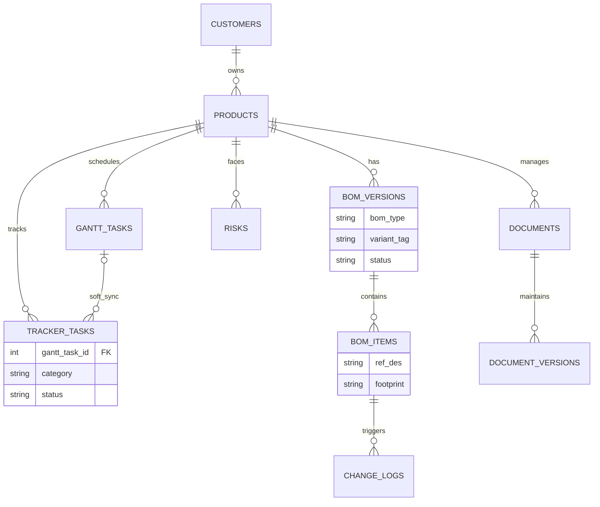

# PLM System Architecture & Development Constraints (V1.0)

## 0. 开发者行为准则 (Developer Behavioral Code)
1. **绝不造轮子**：尽最大可能调用成熟的 npm 包（如 Element Plus, 成熟的甘特图库）和 Python 库来实现功能。首要保证开发速度和系统稳定性。
2. **意图大于字面指令**：PO 负责提供业务蓝图，可能缺乏底层技术细节。如果发现技术指令存在漏洞、有性能隐患，或者有更好的开源方案，绝对不要盲目执行。必须主动理解最终业务意图，纠正技术错误，并给出最优的工程实现路径。

## 1. 核心业务纪律 (Business Disciplines)
* **绝对主键**：`product_id` 是系统唯一的数据隔离中心。任何业务数据必须带有 `product_id`。
* **BOM 变体与防腐**：不建独立的 SKU 表。在 `bom_versions` 表增加 `bom_type` (EE/ME/PKG) 和 `variant_tag` 来支持变体。
* **柔性防呆**：BOM Released 后前端依然允许编辑，后端依靠 `change_logs` 捕捉 JSON Diff 数据，实现极简 ECN。
* **单向软绑定**：NPI 任务 (`tracker_tasks`) 与 `gantt_tasks` 松散耦合。`tracker_tasks` 中保留可为空的 `gantt_task_id`，仅完成状态单向联动。
* **文控血脉**：文件管理遵守 `documents` (逻辑主体) -> `document_versions` (物理文件) 的父子级结构。

## 2. 核心架构红线 (Architecture Rules)
* **绝对主键**：`product_id` 是系统唯一的数据隔离与挂载中心。任何新表必须带 `product_id`。
* **不建 SKU 表**：通过 `bom_versions` 表中的 `bom_type` (EE/ME/PKG) 和 `variant_tag` (如 Base) 来实现软性变体。
* **柔性防呆**：BOM 即使在 `Released` 状态，前端依然允许用户编辑。后端依赖 `change_logs` 捕捉 diff_data，严禁做硬性 403 拦截。
* **单向软绑定**：NPI 任务 (`tracker_tasks`) 与 `gantt_tasks` 是松散耦合。`tracker_tasks` 中包含可为空的 `gantt_task_id`。
* **文控血脉**：文件管理严格遵守 `documents` (逻辑主体) -> `document_versions` (物理文件版本) 的父子级结构。

## 3. 数据库设计防御 (Database Constraints)
* **BOM 版本防冲突**：在 `bom_versions` 中，联合字段 `[product_id, bom_type, variant_tag, version]` 必须建立 Unique 约束。
* **JSON Diff 规范**：`change_logs` 的 `diff_data` 必须是结构化的，格式要求为：`{"field": "quantity", "old": 5, "new": 6}`。

## 4. 终极数据架构 ER 图 (Mermaid)

